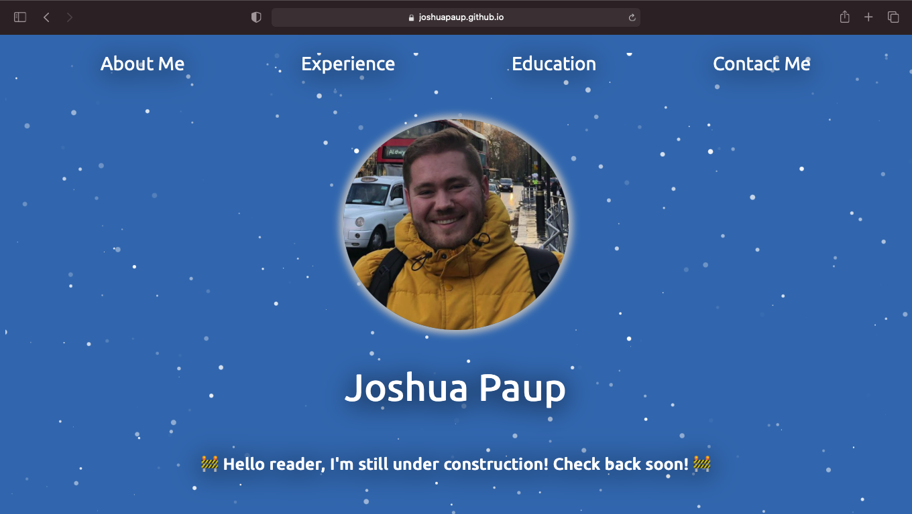

# Personal Website

Hello reader!

Welcome to my GitHub repository for my personal website. The website is currently a work-in-progress but checkout `dev-notes.md` for past development notes!

**Monday, 29 March 2021**
- The homepage of my website is published! 🙂 Feel free to check it out in the link on the top right corner or navigate [here](https://joshuapaup.github.io/joshua-paup/). 
- If you're interested in seeing what it *might* look like, check out the [Figma prototype here](https://www.figma.com/proto/ZZJZYwNrC2lcnwXcgeEeIV/Personal-Website?node-id=2%3A187&scaling=contain&page-id=0%3A1). Notes for the prototype can also be found in `dev-notes.md`. 
- As of right now, the website is built on the [Angular 9](https://angular.io/) framework, utilizes the [particles.js](https://github.com/VincentGarreau/particles.js/) library for the background particles, and utilizes the [gh-pages](https://www.npmjs.com/package/gh-pages) package to publish on [GitHub Pages](https://pages.github.com/). 

## Development server

To demo the project, clone the repository to your local environment and run `ng serve --open` in your terminal. Your browser will (hopefully, automatically) open `http://localhost:4200/` for you. If not, you can navigate to `http://localhost:4200/` yourself. As of Monday, 29 March 2021, you should see this page: 

If you've made it this far, please feel free to email me a message with "GITHUB README READ" as the subject and I will send you back an animal (or dinosaur) photo at random within 24 hours! If you want to choose between an animal or dinosaur, feel free to include that in your email message! Happy coding! 🙂 
