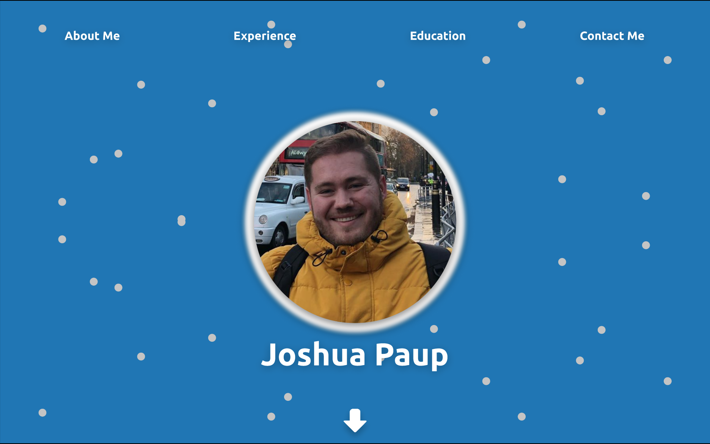
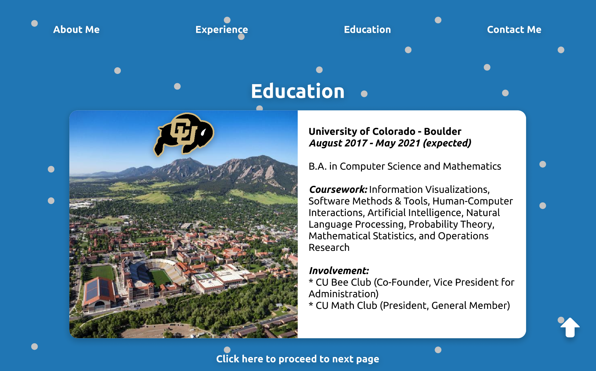

# Development Notes from the Past
Hello reader! Below includes past development notes I've written for the repository!

### Saturday, 27 March 2021 
- The design and prototype of my website is finished! Check out this [Figma prototype](https://www.figma.com/proto/ZZJZYwNrC2lcnwXcgeEeIV/Personal-Website?node-id=2%3A187&scaling=contain&page-id=0%3A1) link to check it for yourself!
- Here's a small preview of the prototype:

  - I'm hoping to keep it as user-friendly as possible through minimizing dense text, utilizing icons, and keeping everything to a single page. 
  - When designing this prototype, I didn't have a long-scroll, single web page in mind (best to figure that out now in prototype rather than later!) so I included a `Click here to proceed to next page` section at the bottom of each page to mimic that.
  - With the exception of logos and icons from several institutions/programming languages/etc., the website follows a color palette generated from [Coolors](https://coolors.co/) and was checked through [WebAIM's Contrast Checker](https://webaim.org/resources/contrastchecker/) to verify readability and accessibility for users. The distinct colors used includes:
    - #1875B6 (French Blue) - Background
    - #C33149 (French Raspberry) - Hyperlinked text
    - #688D77 (Wintegreen Dream) - Footer background, Good or working understanding
    - #FDE849 (Minion Yellow) - Knowledgeable, but could pick it up again quickly
    - #DE7C8D (Shimmering Blush) - It's been awhile, need time to refamiliarize myself
  - Checkout the color palette directly [here](https://coolors.co/1875b6-c33149-688d77-fde849-de7c8d)
  - On the first and second *Experience* pages, I'm unsure whether I'll include those programming languages/tools icons on side of each card, or embed them another way. 
  - On the third *Experience* page, I'm not sure whether I'll keep the card/bar underneath each programming language/tool/etc. I want to try laying out each of those icons on the web page without laying on top of something else. 
  - On the *Education* page, I'm thinking about changing the *Coursework* section to a *Sample Coursework* section to minimize that dense block of text. Maybe when I go to write this section, I'll have a "random" generation of four or five classes in their own bullet list each visit. 
- As I start to tackle writing the ***actual*** website, I'll be bouncing around the direction I want to take regarding frameworks/tools/etc. I may stick with using the Angular framework for now, but please don't be surprised if I revert back to some good ol' fashioned HTML/CSS/JavaScript instead or try out a different framework. Ultimately, I want to emphasize having fun for myself and learn along the way!